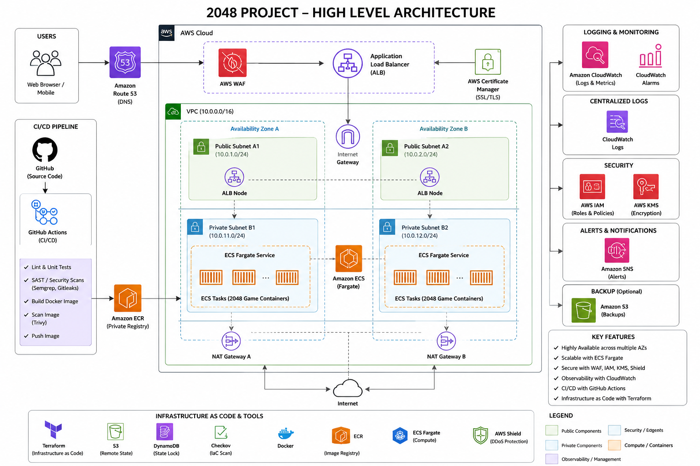
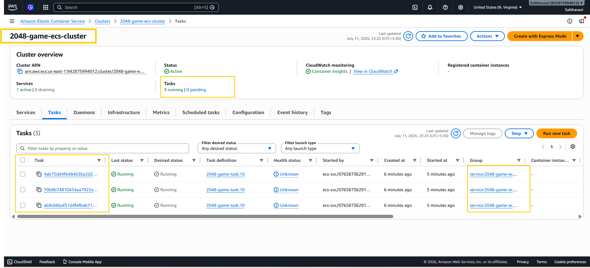
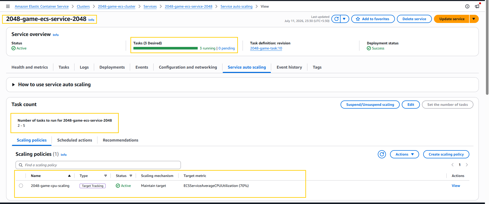
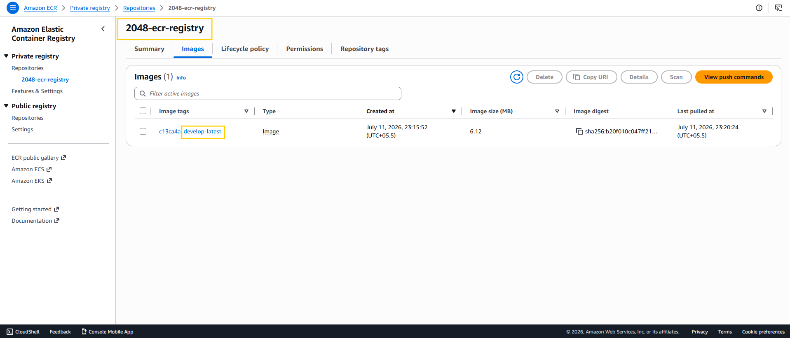
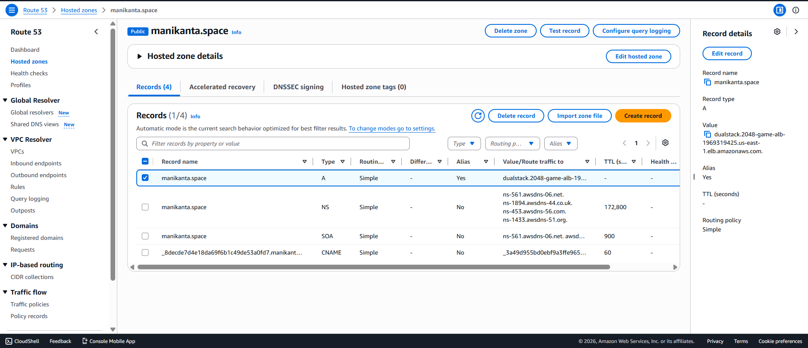
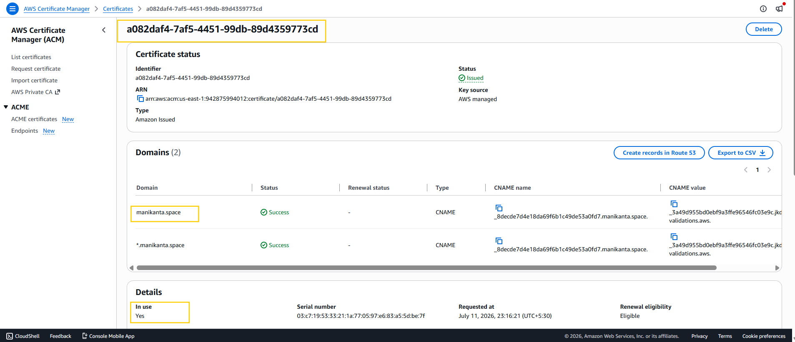
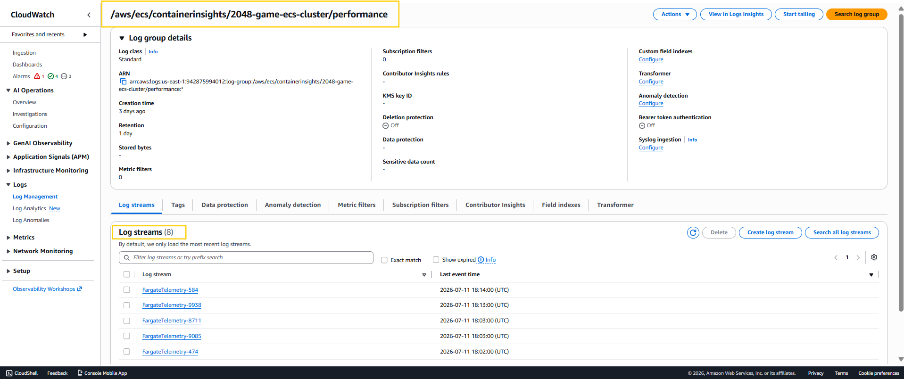
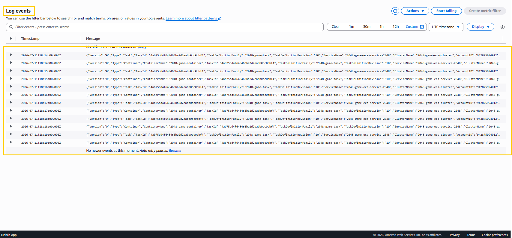
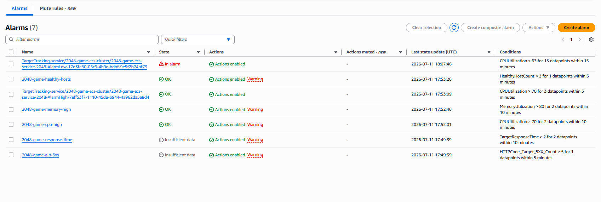
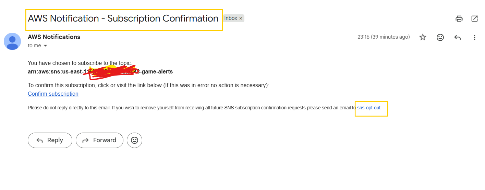

F## Project Overview

This project demonstrates how to deploy a containerized 2048 web application on AWS using Infrastructure as Code (Terraform) and DevSecOps best practices.

The application is deployed on Amazon ECS Fargate behind an Application Load Balancer with HTTPS enabled using AWS Certificate Manager and Route53. The infrastructure is fully automated using Terraform, while GitHub Actions handles CI/CD, Docker image builds, security scanning, and deployments.

2048 is static Front End Application powered by HTML (Markup language), CSS (Styling), Java Script (Dynamic behaviour).

## Objectives

- Build production-style AWS infrastructure using Terraform modules
- Containerize the application using Docker
- Deploy the application on ECS Fargate
- Automate deployments using GitHub Actions
- Enable HTTPS with ACM and Route53
- Implement centralized logging and monitoring
- Apply DevSecOps best practices including vulnerability scanning and IAM least privilege

Deploy the 2048-game in AWS cloud with DevSecOps best practices. Refer the architecture for more details.

## Folder Structure

| Folder       | Description              |
| ------------ | ------------------------ |
| `.github/`   | GitHub Actions workflows |
| `docker/`    | Dockerfile               |
| `terraform/` | Terraform modules        |
| `src/`       | Application source       |
| `scripts/`   | Automation scripts       |
| `diagrams/`  | Architecture diagrams    |

## Architecture Diagram



## User Request Flow

```
User

↓

Route53

↓

Application Load Balancer

↓

Target Group

↓

ECS Service

↓

Running ECS Tasks

↓

2048 Application

```

### Tools used

Technologies & Tools

| Category         | Technology     |
| ---------------- | -------------- |
| IaC              | Terraform      |
| Containerization | Docker         |
| CI/CD            | GitHub Actions |
| Version Control  | Git & GitHub   |
| Scripting        | Python         |

AWS Services

| Service         | Purpose              |
| --------------- | -------------------- |
| VPC             | Networking           |
| ECS Fargate     | Run containers       |
| ECR             | Docker registry      |
| ALB             | Traffic distribution |
| Route53         | DNS                  |
| ACM             | SSL                  |
| CloudWatch      | Monitoring           |
| SNS             | Alerts               |
| IAM             | Authentication       |
| Security Groups | Network Security     |

### Branching-Strategy

```
main
│
├── develop
│
├── feature/*
│
└── terraform/*
```


| Branch          |Description                                                                                                                 |
| --------------- | --------------------------------------------------------------------------------------------------------------------------- |
| **main**        | Stable production-ready branch containing thoroughly tested and deployable code.                                            |
| **develop**     | Primary integration branch where new features are merged before production release.                                         |
| **feature/***   | Individual feature development branches created from `develop` for implementing new functionality.                          |
| **terraform/*** | Dedicated branches for developing and testing Infrastructure as Code (Terraform) changes independently of application code. |


### CI/CD flow

```
Developer

↓

Git Push

↓

GitHub Actions

↓

Semgrep SAST

↓

GitLeaks

↓

Build Docker Image

↓

Trivy Scan

↓

Push Image to ECR

↓

ECS Rolling Deployment

↓

Application Updated

```

### Dockerfile

| Dockerfile Instruction                   | Why it is Used                                                                                                                                                                                     |
| ---------------------------------------- | -------------------------------------------------------------------------------------------------------------------------------------------------------------------------------------------------- |
| **`FROM nginx:1.31.2-alpine-slim`**      | Uses the official Nginx image to efficiently serve the static 2048 web application. The Alpine Slim variant provides a lightweight image with a smaller attack surface and faster image downloads. |
| **`COPY src/ /usr/share/nginx/html/`**   | Copies the application's static files (HTML, CSS, JavaScript, and assets) into Nginx's default web root so they can be served to users.                                                            |
| **`EXPOSE 80`**                          | Documents that the container listens for HTTP traffic on port 80. ECS uses this port mapping to route traffic from the Application Load Balancer to the container.                                 |
| **`CMD ["nginx", "-g", "daemon off;"]`** | Starts the Nginx web server in the foreground, which is the recommended way to keep a Docker container running.                                                                                    |

### AWS Infrastructure

The infrastructure is provisioned using modular Terraform. Each module is responsible for a specific layer of the AWS architecture, making the infrastructure reusable, maintainable, and scalable.

| Module                               | Description                                                                                                                                                                                      |
| ------------------------------------ | ------------------------------------------------------------------------------------------------------------------------------------------------------------------------------------------------ |
| **Networking**                       | Creates the VPC, public and private subnets across multiple Availability Zones, Internet Gateway, NAT Gateways, Elastic IPs, and route tables to provide secure and highly available networking. |
| **Security**                         | Provisions Security Groups for the Application Load Balancer and ECS tasks, ensuring only required inbound and outbound traffic is allowed following the principle of least privilege.           |
| **Application Load Balancer (ALB)**  | Deploys an internet-facing Application Load Balancer, Target Group, and HTTP/HTTPS listeners to distribute incoming traffic and perform health checks on ECS tasks.                              |
| **Elastic Container Registry (ECR)** | Creates a private container registry to securely store Docker images used by the ECS service.                                                                                                    |
| **Elastic Container Service (ECS)**  | Creates the ECS Cluster, Task Definition, IAM Execution Role, CloudWatch Log Group integration, and ECS Service running on AWS Fargate.                                                          |
| **AWS Certificate Manager (ACM)**    | Provisions and validates an SSL/TLS certificate to enable secure HTTPS communication for the application.                                                                                        |
| **Amazon Route 53**                  | Manages DNS records and routes the custom domain (`manikanta.space`) to the Application Load Balancer using Alias records.                                                                       |
| **Monitoring**                       | Configures CloudWatch Log Groups, CloudWatch Alarms, and Amazon SNS notifications to provide centralized logging, monitoring, and operational alerts.                                            |
| **Auto Scaling**                     | Configures ECS Service Auto Scaling policies that automatically increase or decrease the number of running tasks based on CloudWatch metrics such as CPU and memory utilization.                 |

## Infrastructure Provisioning Flow

```
Terraform
     │
     ▼
Networking
     │
     ▼
Security
     │
     ▼
Application Load Balancer
     │
     ▼
Elastic Container Registry
     │
     ▼
Amazon ECS (Fargate)
     │
     ▼
AWS Certificate Manager
     │
     ▼
Amazon Route 53
     │
     ▼
Monitoring
     │
     ▼
Auto Scaling

```

## Autoscaling

The application uses Amazon ECS Service Auto Scaling to automatically adjust the number of running ECS tasks based on application load. CloudWatch continuously monitors ECS metrics and triggers scaling actions when predefined thresholds are reached.

## Scale-Out Flow

```
High Traffic
      │
      ▼
CPU Utilization > 70%
      │
      ▼
CloudWatch Metric Alarm
      │
      ▼
ECS Auto Scaling Policy
      │
      ▼
Increase Desired Task Count
      │
      ▼
New ECS Task Starts
      │
      ▼
ALB Health Check
      │
      ▼
Traffic Distributed to New Task

```
## Scale-In Flow

```

Low Traffic
      │
      ▼
CPU Utilization < 30%
      │
      ▼
CloudWatch Metric Alarm
      │
      ▼
ECS Auto Scaling Policy
      │
      ▼
Decrease Desired Task Count
      │
      ▼
ECS Drains Existing Connections
      │
      ▼
Task Stops Gracefully

```
## Security

Security has been incorporated throughout the infrastructure following AWS and DevSecOps best practices.

| Security Feature                  | Description                                                                                                                                                                                           |
| --------------------------------- | ----------------------------------------------------------------------------------------------------------------------------------------------------------------------------------------------------- |
| **IAM Roles**                     | Uses dedicated IAM roles with least-privilege permissions for ECS task execution, Terraform provisioning, and GitHub Actions deployments.                                                             |
| **OIDC Authentication**           | GitHub Actions authenticates to AWS using OpenID Connect (OIDC), eliminating the need to store long-lived AWS access keys as GitHub secrets.                                                          |
| **Security Groups**               | Restricts network access by allowing only the required traffic between the Application Load Balancer and ECS tasks.                                                                                   |
| **HTTPS Encryption**              | All client traffic is encrypted using HTTPS to ensure secure communication between users and the application.                                                                                         |
| **AWS Certificate Manager (ACM)** | Automatically provisions and manages SSL/TLS certificates for the custom domain without manual certificate renewal.                                                                                   |
| **Private Subnets**               | ECS tasks are deployed in private subnets and are not directly accessible from the internet. Only the Application Load Balancer receives public traffic.                                              |
| **Amazon ECR Image Scanning**     | Container images are scanned for known vulnerabilities before deployment using Amazon ECR image scanning.                                                                                             |
| **Trivy Vulnerability Scanning**  | GitHub Actions performs automated vulnerability scanning on Docker images before pushing them to Amazon ECR, helping identify critical and high-severity vulnerabilities early in the CI/CD pipeline. |

### Monitoring screenshots

### Scaling screenshots

## ECS screenshots





## ECR screenshots



## Route53 screenshots



## ACM screenshots



## Cloudwatch Logs






## Deployment steps

1. Modify the application source code.
2. Commit and push the changes to the develop branch.
3. GitHub Actions automatically builds a new Docker image (docker-build-push.yaml).
4. The image is scanned using Trivy for vulnerabilities.
5. The image is pushed to Amazon ECR using the mutable develop-latest tag.
6. After the image is successfully pushed, ECS is instructed to perform a forced rolling deployment.
```
aws ecs update-service \
  --cluster 2048-game-ecs-cluster \
  --service 2048-game-ecs-service-2048 \
  --force-new-deployment

```
7. ECS launches new tasks that pull the latest Docker image from Amazon ECR.
8. The Application Load Balancer performs health checks on the new tasks.
9. Once the new tasks become healthy, ECS gracefully drains and stops the old tasks.
10. The deployment completes with minimal downtime.


## Challenges faced

| Challenge                                     | Resolution                                                                                                                                                                                                                                          |
| --------------------------------------------- | --------------------------------------------------------------------------------------------------------------------------------------------------------------------------------------------------------------------------------------------------- |
| **ECS Target Group Health Checks (HTTP 403)** | Investigated the Application Load Balancer, Target Group, ECS Task Definition, Security Groups, and container configuration to identify the root cause. Corrected the load balancer and health check configuration until ECS tasks became healthy.  |
| **ACM DNS Validation**                        | Configured Route53 DNS validation records using Terraform and verified certificate issuance before associating it with the HTTPS listener.                                                                                                          |
| **Route53 DNS Propagation**                   | Updated the domain registrar's nameservers to Route53 and waited for global DNS propagation before the custom domain became accessible.                                                                                                             |
| **ECR Immutable Tag Conflict**                | Initially configured the ECR repository with immutable image tags, which prevented overwriting the `develop-latest` tag. Changed the repository to use mutable tags to support the project's rolling deployment strategy.                           |
| **ECS Image Deployment**                      | Learned that pushing a new Docker image to ECR does not automatically update running ECS tasks. Implemented ECS rolling deployments using `aws ecs update-service --force-new-deployment` to deploy updated container images with minimal downtime. |
| **Terraform State Lock**                      | Encountered remote state locking during infrastructure provisioning and resolved it using `terraform force-unlock` after confirming no other Terraform operations were running.                                                                     |
| **ALB Listener & Target Group Configuration** | Correctly configured HTTP to HTTPS redirection, HTTPS listener, Target Group association, and ECS Service integration to enable secure traffic routing to containerized applications.                                                               |
| **Custom Domain Configuration**               | Configured Route53 Alias records to route `manikanta.space` to the Application Load Balancer and validated end-to-end HTTPS connectivity.                                                                                                           |
| **CloudWatch Logging**                        | Configured the ECS task definition to use the `awslogs` log driver, enabling centralized application logging through Amazon CloudWatch.                                                                                                             |

---
